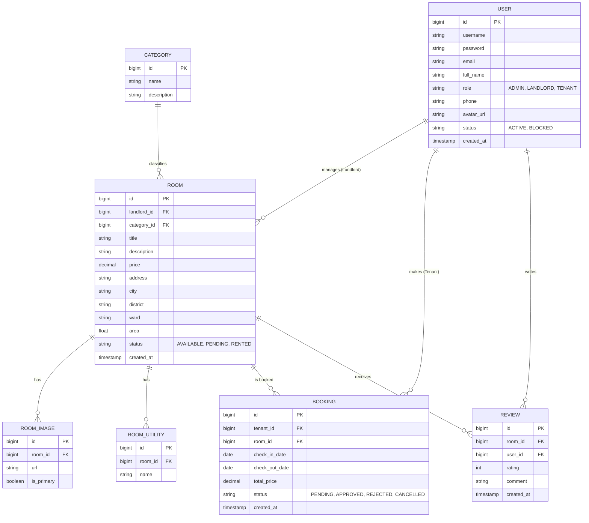

# Room Rental Platform - ERD (Entity Relationship Diagram)

This diagram describes the database structure for the Room Rental Platform, supporting three main roles: **ADMIN**, **LANDLORD**, and **TENANT**.

